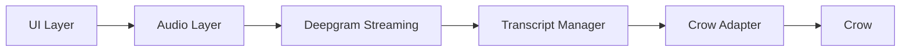
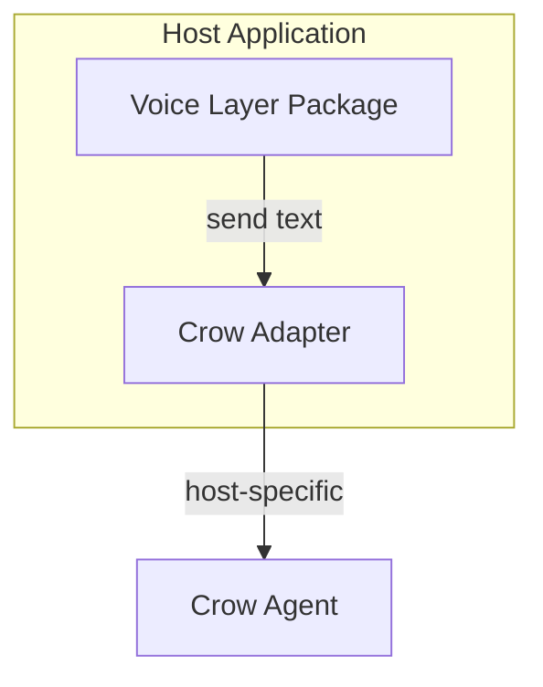

# Crow Voice Layer — Implementation Guide

This guide describes how to implement and embed the voice layer. It follows the same flow as [architecture.md](architecture.md): UI → Audio → Deepgram → Transcript → Adapter → Crow.

---

## Flow diagram



**Runtime sequence:** User clicks mic → browser records → audio streamed to Deepgram → Deepgram returns transcript → transcript cleaned → UI shows text → user edits → user clicks Send → adapter sends to Crow → Crow executes.

---

## Embedding the voice layer (easy integration)

The voice layer can run in any application that already has Crow. Default integration requires no provider; use the provider only when you need a custom Crow adapter.

1. **Install or add the package**  
   Use the NPM package (e.g. `crow-voice-layer`) when published, or embed the code (monorepo package / copy into app).

2. **Ensure Tailwind and Crow are available**  
   The voice UI requires Tailwind (or the package’s CSS). Include it in your build or content. Ensure Crow is on the page (SDK or DOM) so the built-in adapter can find it.

3. **Render `<VoicePanel />`**  
   No provider is required for the default case. The voice layer uses built-in SDK or DOM adapter detection (`getCrowAdapter()`).

4. **Optional: custom Crow adapter**  
   Only if your app talks to Crow in a non-standard way, wrap your app or the voice subtree with `VoiceLayerProvider(crowAdapter)` and pass your `CrowAdapter` instance.

**Example (default):**

```tsx
import { VoicePanel } from "crow-voice-layer";

export default function Page() {
  return (
    <main>
      <VoicePanel />
    </main>
  );
}
```

**Example (custom adapter):**

```tsx
import { VoicePanel, VoiceLayerProvider } from "crow-voice-layer";
import { myCrowAdapter } from "./my-adapter";

export default function Page() {
  return (
    <VoiceLayerProvider crowAdapter={myCrowAdapter}>
      <VoicePanel />
    </VoiceLayerProvider>
  );
}
```

---

## Providing a custom Crow adapter

When your host app integrates Crow in a non-standard way (e.g. bridge, postMessage, or custom SDK), implement the `CrowAdapter` interface and pass it into the voice layer.

**Interface (from `crow-voice-layer`):**

```ts
interface CrowAdapter {
  isAvailable(): boolean;
  send(text: string): void;
}
```

- **`isAvailable()`:** Return `true` when your adapter can send to Crow in the current environment.
- **`send(text)`:** Send the transcript text to Crow using your app’s mechanism (e.g. postMessage, bridge call, or DOM).

Then wrap the voice layer with `VoiceLayerProvider(crowAdapter)`. No changes are required inside the voice layer core.

---

## Phase E: Crow adapter and injection

- **Built-in adapters:** The package ships SDK and DOM adapters. The SDK adapter is used when Crow exposes an API (e.g. on `window`); the DOM adapter is used when the page has an input with `[data-crow-input]`.
- **Injection:** The host can pass a custom `CrowAdapter` via `VoiceLayerProvider(crowAdapter)`. When no adapter is provided, the voice layer uses `getCrowAdapter()` (SDK then DOM). The host only needs the provider when supplying a custom adapter.

---

## Embedding diagram



- **Host application:** Any app (Next.js, CRA, etc.) that already integrates Crow.
- **Voice Layer Package:** UI + audio + Deepgram + transcript; uses the adapter on Send.
- **Crow Adapter:** Either host-provided (custom) or built-in (SDK/DOM); same interface.

---

## Publishing and consumption

**Public API (single entry)**  
Import only from `crow-voice-layer`. Do not depend on internal paths (e.g. `crow-voice-layer/src/...`).

- **Components:** `VoicePanel`, `VoiceLayerProvider`
- **Hooks:** `useSendToCrow`, `useVoicePipeline`, `useTranscriptManager`
- **Context:** `useVoiceLayerContext`, `VoiceLayerContextValue`, `VoiceLayerProviderProps`
- **Crow:** type `CrowAdapter`, `sdkCrowAdapter`, `domCrowAdapter`, `getCrowAdapter`
- **Config:** `DEFAULT_DEEPGRAM_TOKEN_URL` (default token API URL; overridable via provider or env)

### NPM

1. In this repo: run `npm run build:lib`, then `npm publish` (or use CI). Set `"private": false` in `package.json` when ready to publish.
2. Consumers: run `npm install crow-voice-layer` and `import { VoicePanel, VoiceLayerProvider, ... } from 'crow-voice-layer'`. Ensure Tailwind and Crow are available on the page (see [Embedding the voice layer](#embedding-the-voice-layer-easy-integration)).

### Embed this code (no registry)

When not publishing to npm:

1. **Local package:** Build the library once (`npm run build:lib` in this repo). In the host app, add a dependency such as `"crow-voice-layer": "file:../path/to/crow-voice-layer"`. The host resolves the package to that folder; Node uses `main`/`exports` from that folder’s `package.json` (pointing at `dist/`).
2. **Monorepo workspace:** Add this repo as a workspace package, run `build:lib` in it, and have the app depend on the workspace package name. The app imports from the package name and uses the built `dist/` output.

Copying the `src/` tree into the host repo is possible but not recommended (path alias and dependency management become the host’s responsibility). Prefer local package or workspace plus library build.

---

## Error handling

| Error            | Behavior                |
|------------------|-------------------------|
| Mic denied       | Show permission UI       |
| No speech        | Show retry               |
| Network drop     | Reconnect                |
| STT failure      | Fallback message         |
| Crow unavailable | Disable Send             |

Handling is implemented in the relevant layer (audio, Deepgram client, transcript manager, adapter / UI). See [architecture.md](architecture.md) § Error Handling.

---

## Security checklist

- Audio is not stored.
- Transcript exists only in memory.
- API keys are not exposed (use env or backend token).
- Explicit microphone permission is required.

See [architecture.md](architecture.md) § Security Design.

---

## Styling and layout

- **Tailwind:** The voice UI is built with Tailwind and shadcn components. The host app must have Tailwind (or include the package’s CSS) and include the voice layer in its Tailwind content if using Tailwind.
- **TooltipProvider:** The voice panel uses tooltips. Either wrap the app with `TooltipProvider` (e.g. at root) or wrap only the voice subtree. The package does not assume a specific app layout.

---

## Testing order

Suggested order to validate the flow:

1. **UI with mocks** — VoicePanel with mock transcript and send.
2. **Audio only** — Mic permission and recording (no Deepgram).
3. **Add Deepgram** — Streaming STT and transcript events.
4. **Add transcript manager** — Cleaning and final transcript in UI.
5. **Add adapter** — Send to Crow (SDK or DOM, or custom via provider).

---

## Prerequisites and setup

- **Stack:** Next.js (or any React app), TypeScript, Tailwind. The reference app uses shadcn/ui.
- **Dependencies:** Deepgram SDK (or equivalent), React, Tailwind. See `package.json`.
- **Deepgram (default — no key required):** When using the **default token endpoint**, host apps do **not** need to set any Deepgram API key or environment variables. The default endpoint is provided by the package; the API key is stored securely only on the package’s deployment (Vercel environment variables, preferably marked **Sensitive**). Hosts just install the package and render `<VoicePanel />`; the client fetches a short-lived token from the package’s token API when the user starts recording.
- **Deepgram (optional override):** Hosts that prefer to use their own API key can pass it via a future provider/context option. Hosts that run their own token endpoint can override the token URL (see [Default token URL and overrides](#default-token-url-and-overrides)).
- **Folder structure:** See `src/` with `audio/`, `deepgram/`, `transcript/`, `crow/`, `components/voice/`, `context/`, and `src/index.ts` as the public API entry.

---

## Deployment (package reference / token API)

The package’s reference app (this Next.js app) must be deployed so that the default token endpoint is available. Host apps that use the default integration rely on it.

1. **Deploy to Vercel**  
   Deploy this repo (the Next.js app) to Vercel. This is the “package backend” or “reference” deployment that serves `/api/deepgram-token`.

2. **Set the Deepgram API key**  
   In the Vercel project that deploys this app: **Project Settings → Environment Variables**. Add `DEEPGRAM_API_KEY` with your Deepgram API key. Prefer marking it **Sensitive** so it is not visible in the dashboard. This key is used only on the server to call Deepgram’s `/v1/auth/grant`; it is never sent to the client.

3. **Keep the default URL in sync**  
   The package constant **`DEFAULT_DEEPGRAM_TOKEN_URL`** (in `src/config.ts`) must match this deployment’s URL, e.g. `https://<your-vercel-project>.vercel.app/api/deepgram-token`. When you change the deployment URL (e.g. new project or custom domain), update the constant and release a new package version so hosts use the correct endpoint.

Optional: use [Vercel’s integration with Doppler](https://vercel.com/docs/integrations/doppler) or another secret manager to inject `DEEPGRAM_API_KEY` into Vercel env instead of storing it directly in the project.

---

## Token API: CORS and rate limiting

The `/api/deepgram-token` route includes CORS and abuse protection:

- **CORS:** Responds with `Access-Control-Allow-Origin`. By default uses `*` so host apps on any origin can call the endpoint. For tighter security, set `DEEPGRAM_TOKEN_ALLOWED_ORIGINS` (comma-separated list of origins, e.g. `https://myapp.com,https://staging.myapp.com`) to restrict which domains can fetch tokens.
- **Rate limiting:** In-memory rate limit of 60 requests per minute per IP (from `x-forwarded-for` or `x-real-ip`). When exceeded, the route returns `429 Too Many Requests` with `Retry-After: 60`. Per-instance only (serverless); provides burst protection without external services.

---

## Default token URL and overrides

- The package exports **`DEFAULT_DEEPGRAM_TOKEN_URL`**, which points to the package maintainers’ token API (this repo deployed to Vercel). When no API key is provided, the client uses this URL to fetch a short-lived token when recording starts.
- **Override (optional):** Host apps that run their own token endpoint can override the URL by passing **`deepgramTokenUrl`** to **`VoiceLayerProvider`** when that prop is implemented (or by passing an equivalent option into the component that configures the pipeline). Until then, the pipeline uses `DEFAULT_DEEPGRAM_TOKEN_URL` when no API key is set. The constant in the package must match the maintainers’ Vercel deployment URL; see [Deployment](#deployment-package-reference--token-api).

---

## SDK compatibility (token as Bearer)

Deepgram’s docs state that **temporary tokens** from `/v1/auth/grant` are passed as **`Authorization: Bearer <token>`** and that the `/listen` WebSocket API supports them. The `@deepgram/sdk` uses different auth depending on what you pass:

- **API key (string):** The SDK sends `Authorization: Token <key>` and uses the WebSocket subprotocol `["token", key]`.
- **Access token (JWT):** When the client is created with an **access token** (e.g. `createClient({ accessToken: jwt })`), the SDK sends `Authorization: Bearer <token>` and uses the subprotocol `["bearer", token]`.

This package uses the **access token** path when the client obtains a JWT from the token URL: the pipeline passes the fetched `access_token` into the Deepgram client as **`accessToken`**, so the SDK uses Bearer auth and the WebSocket bearer subprotocol. When the host provides an API key directly, the client uses that as the SDK **key**, which uses Token auth. No adapter or SDK upgrade is required; the existing `@deepgram/sdk` supports both.

---

## Implementation phases (reference)

| Phase | Layer           | Purpose                                      |
|-------|-----------------|----------------------------------------------|
| A     | UI              | Mic toggle, transcript, edit, send           |
| B     | Audio           | Microphone capture and stream chunks         |
| C     | Deepgram        | WebSocket STT, send chunks, receive events   |
| D     | Transcript      | Merge partials, clean text, confidence      |
| E     | Crow adapter    | Interface + SDK/DOM + optional injection     |
| F     | Wiring          | Connect pipeline; optional backend token     |

See [architecture.md](architecture.md) for module and interface details.

---

## Out of scope (v1)

- Wake word, auto execution, TTS, multilingual, mobile native (see architecture § Non Goals).
- Deepgram config from host: the voice layer uses its own env so integration stays simple.
